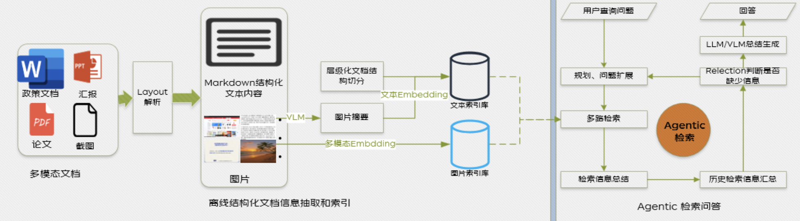

# MosaicAgent

> 面向企业软件项目的多模态 RAG 单 Agent 技术知识库助手

MosaicAgent 是一个面向企业软件项目技术资料的多模态 RAG Agent 应用。本项目基于 [JoyAgent-JDGenie](https://github.com/jd-opensource/joyagent-jdgenie) 的 MRAG 模块完成独立抽取、模块裁剪和工程化改造，将 PDF、DOCX、Markdown、TXT、PNG、JPG 等资料转换为可检索的文本、图片和页面证据，再由单 Agent 完成查询扩展、多路检索、证据判断、LLM/VLM 路由和带引用的流式回答。

项目包含一个 FastAPI 后端和一个轻量 React 工作台，形成从文档入库、跨模态检索、Agent 决策到可追溯答案生成的完整应用闭环。



## 界面与能力

启动 React 工作台后，可以在浏览器中完成：

- 创建、切换和删除知识库。
- 上传文档并查看异步入库状态。
- 对文本知识和图片知识进行提问。
- 查看 Markdown 格式答案和结构化引用。
- 实时观察查询规划、多路检索、证据判断、重排和 LLM/VLM 路由。

访问地址：`http://127.0.0.1:5173`

## 典型使用场景

MosaicAgent 面向企业软件项目中的技术知识查询，适合将分散在文档、架构图和系统截图中的信息统一纳入一个可追溯的问答入口：

- 研发人员查询系统架构、模块职责、接口说明和技术方案。
- 测试人员查询业务流程、异常处理、测试说明和接口约束。
- 运维人员查询部署手册、配置说明、故障排查步骤和监控截图。
- 新成员通过项目文档、架构图和页面截图快速理解系统结构与技术链路。

当前仓库中的 `examples/knowledge/mosaic_overview.md` 和 `docs/img/mrag/mrag_struct.png` 主要用于验证文档入库、跨模态检索和 Agent 问答的端到端链路，属于最小技术示例，并不代表完整的企业业务知识库。替换 `examples/` 下的资料即可接入具体项目文档。

## 核心能力

- 支持 PDF、DOCX、Markdown、TXT、PNG、JPG 文档。
- 统一处理文本、独立图片和完整页面三类内容。
- 使用文本稠密向量、BM25 稀疏向量和多模态向量。
- 使用 Qdrant 保存向量，使用 SQLite 保存知识库和文件元数据。
- 提供文本向量、BM25、图片向量、页面向量四路检索。
- 支持查询扩展、证据摘要、证据充分性判断和有限轮次查询改写。
- 根据问题和视觉证据动态选择 LLM 或 VLM。
- 通过供应商无关的 SSE 事件协议暴露 Agent 运行轨迹。
- 对远程下载、文件路径、Markdown 资源、CORS 和模型失败进行边界控制。

## 当前范围

### 保留

- 多模态文档解析、切分、OCR、图片描述和页面渲染。
- 文本、图片、页面索引和检索。
- 单 Agent 检索循环、重排和 LLM/VLM 生成。
- Qdrant、SQLite、FastAPI、本地文件存储和 React 工作台。

### 暂不包含

- Data Agent、Table RAG、NL2SQL、Deep Search。
- 报告生成、代码解释器、SOP 和复杂数据分析。
- 原项目的多 Agent 任务编排。
- 登录、租户、权限、长期记忆和生产监控。
- 正式评测平台、Docker Compose 和 CI/CD。

当前 Agent 是有边界的单 Agent：一次请求最多执行 `MRAG_MAX_ROUNDS` 轮检索，每轮最多生成 `MRAG_MAX_SUBQUERIES` 个查询；它不保存跨请求对话记忆。

## 工作原理

### 文档入库链路

```text
文件上传
  -> 本地受控存储
  -> Parser 解析与页面渲染
  -> 文本切块 + 图片提取 + OCR/图片描述
  -> 文本向量 + BM25 + 多模态向量
  -> Qdrant 三类集合
  -> SQLite 文件状态与知识库元数据
```

### Agent 问答链路

```text
用户问题/图片
  -> 是否需要检索
  -> 查询扩展
  -> 文本稠密 / BM25 / 图片 / 页面四路检索
  -> 子问题证据摘要
  -> 证据充分性判断
  -> 必要时改写问题并进入下一轮
  -> 结果合并、去重和文本重排
  -> LLM/VLM 动态路由
  -> 带引用的流式答案
```

### 三个集合与四路检索

项目使用三个 Qdrant 集合：

| 集合 | 内容 | 向量 |
| --- | --- | --- |
| `mosaic_mrag_text_vectors` | 文本块、OCR 文本、图片 Caption | 文本稠密向量 + BM25 稀疏向量 |
| `mosaic_mrag_image_vectors` | 文档内独立图片 | 多模态稠密向量 |
| `mosaic_mrag_page_vectors` | 完整页面截图 | 多模态稠密向量 |

文本集合同时承担稠密和稀疏检索，因此三个集合可以提供四路检索。独立上传的 PNG 默认由 `ImageParser` 作为页面处理，所以它可能主要出现在页面集合，而图片 OCR 和 Caption 会进入文本集合。

## 快速开始

### 前置环境

- Python 3.11 或 3.12。
- [uv](https://docs.astral.sh/uv/)。
- Node.js 20 或更高版本。
- npm。
- 可调用的 LLM、VLM、文本 Embedding、多模态 Embedding 和 Reranker 服务。

默认使用本地 Qdrant 持久化模式，不需要 Docker；默认绑定本机地址，适合单机和单进程运行。

### 1. 获取项目

```bash
git clone https://github.com/<your-name>/MosaicAgent.git
cd MosaicAgent
```

### 2. 配置后端环境

Windows PowerShell：

```powershell
cd genie-tool
Copy-Item .env_template .env
```

Linux/macOS：

```bash
cd genie-tool
cp .env_template .env
```

然后编辑 `genie-tool/.env`，填写模型服务配置。`.env_template` 只是模板，真实 `.env` 不会从 GitHub 下载，也不应该提交到 Git。

### 3. 安装 Python 依赖

```bash
cd genie-tool
uv sync
```

后端依赖由 `pyproject.toml` 和 `uv.lock` 管理，不需要手动逐个执行 `pip install`。`uv sync` 会创建项目虚拟环境并安装核心依赖和开发测试依赖。

### 4. 配置模型

最小可运行闭环需要以下五类能力：

| 能力 | 主要变量 | 用途 |
| --- | --- | --- |
| LLM | `LLM_API_KEY`、`LLM_MODEL_NAME`、`LLM_MODEL_BASE_URL` | 查询判断、查询扩展、证据总结、文本回答 |
| VLM | `VLM_API_KEY`、`VLM_MODEL_NAME`、`VLM_MODEL_BASE_URL` | OCR、图片描述、视觉问答和多模态回答 |
| 文本 Embedding | `TEXT_EMBEDDING_API_KEY`、`TEXT_EMBEDDING_MODEL_NAME`、`TEXT_EMBEDDING_BASE_URL` | 文本、OCR、Caption 和问题向量化 |
| 多模态 Embedding | `DASHSCOPE_API_KEY`、`DASHSCOPE_MULTIMODAL_EMBEDDING_MODEL_NAME` | 图片和页面向量化 |
| Reranker | `TEXT_RERANKER_API_KEY`、`TEXT_RERANKER_MODEL_NAME`、`TEXT_RERANKER_BASE_URL` | 文本证据二次排序 |

当前默认配置为：

```text
OCR_TYPE=vlm-ocr
```

这表示 OCR 复用 VLM，一般不需要单独配置 DeepSeek OCR。更换模型供应商时，请根据供应商是否支持对应接口填写地址和模型名；不要把真实 Key 写进 README 或提交到 Git。

### 5. 初始化本地存储

```bash
uv run python -m genie_tool.tool.mrag.init.init_db
```

该命令会创建或检查：

- SQLite 知识库和文件元数据表。
- `mosaic_mrag_text_vectors`。
- `mosaic_mrag_image_vectors`。
- `mosaic_mrag_page_vectors`。

### 6. 启动后端

```bash
uv run uvicorn server:app --host 127.0.0.1 --port 1601
```

后端地址：

```text
健康检查：http://127.0.0.1:1601/health
配置检查：http://127.0.0.1:1601/ready
Swagger：http://127.0.0.1:1601/docs
```

`/ready` 返回 `200` 且 `ready=true` 才表示存储、模型和运行配置均已就绪。返回 `503` 通常表示配置缺失或配置格式错误，不一定是服务没有启动。

### 7. 安装并启动前端

另开一个终端：

```bash
cd web
npm install
npm run dev
```

前端依赖由 `package.json` 和 `package-lock.json` 管理。打开：

```text
http://127.0.0.1:5173
```

Vite 会将 `/health`、`/ready` 和 `/v1` 代理到 1601 端口；前端不会接触模型 API Key。

## 端到端体验

在后端已经启动并且 `/ready` 就绪后：

```bash
cd genie-tool
uv run python scripts/demo.py
```

演示脚本会完成一条真实的多模态 RAG Agent 链路：

1. 创建或复用 `mosaic-demo` 知识库。
2. 上传 `examples/knowledge/mosaic_overview.md` 和 MRAG 架构图。
3. 提交文件入库任务，并轮询到 `SUCCESS` 或 `FAILED`。
4. 发起一次单 Agent 流式问答。
5. 输出查询规划、多路检索、证据判断、模型路由和答案增量。

`mosaic-demo` 只是默认演示知识库 ID，不是特殊数据结构。可以在 `.env` 中修改 `DEFAULT_KB_ID`，也可以在问答请求中显式传入其他 `kb_id`。

该体验会调用外部模型 API，可能产生少量费用；只想检查服务状态可以先访问 `/health` 和 `/ready`。

## `.env` 配置说明

完整配置模板见：

```text
genie-tool/.env_template
```

常用运行配置：

| 配置 | 默认值 | 说明 |
| --- | --- | --- |
| `DEFAULT_KB_ID` | `mosaic-demo` | 未显式传入 `kb_id` 时使用 |
| `MRAG_MAX_ROUNDS` | `3` | Agent 最大检索轮数 |
| `MRAG_MAX_SUBQUERIES` | `3` | 每轮最多子查询数 |
| `MRAG_MAX_TEXT_CONTEXTS` | `8` | 最终文本上下文上限 |
| `MRAG_MAX_VISUAL_CONTEXTS` | `1` | 最终视觉上下文上限 |
| `QDRANT_MODE` | `local` | `local` 使用本地持久化，`server` 使用 Qdrant 服务 |
| `QDRANT_PATH` | `./data/qdrant` | 本地 Qdrant 数据目录 |
| `SQLITE_PATH` | `./data/mrag.sqlite3` | SQLite 文件路径 |
| `LOCAL_STORAGE_PATH` | `./data/files` | 本地上传文件目录 |

远程文件、网页和 Markdown 远程图片默认关闭。需要显式配置对应开关和主机白名单后才会启用。

## 文件入库 API

本地文件入库采用两步契约，避免客户端直接传递任意本地路径。

### 第一步：上传原始文件

```text
POST /v1/documents/upload
```

返回：

```json
{
  "data": {
    "document_id": "upload-id",
    "filename": "lesson.md",
    "permanent_url": "http://127.0.0.1:1601/v1/storage/local/..."
  }
}
```

### 第二步：提交入库任务

```text
POST /v1/documents/add_files
```

请求体：

```json
{
  "kb_id": "mosaic-demo",
  "files": [
    {
      "document_id": "upload-id",
      "filename": "lesson.md"
    }
  ]
}
```

返回的 `file_id` 是后台入库任务 ID，不等同于上传阶段的 `document_id`。随后轮询：

```text
POST /v1/documents/list_kb_files
```

直到对应文件的 `file_status` 变为：

```text
SUCCESS 或 FAILED
```

## Agent 问答 API

```text
POST /v1/mrag/query
```

请求体：

```json
{
  "kb_id": "mosaic-demo",
  "question": "这个知识库的核心内容是什么？",
  "image_urls": [],
  "include_trace": true
}
```

接口返回 `text/event-stream`。主要事件为：

```text
run_started
query_planned
retrieval_completed
evidence_evaluated
rerank_completed
route_selected
generation_started
answer_delta
run_completed
```

其中：

- `query_planned`：查询扩展结果。
- `retrieval_completed`：四个检索通道的命中数、耗时和状态。
- `evidence_evaluated`：证据是否充分，以及是否继续下一轮。
- `route_selected`：最终选择 `llm` 或 `vlm`。
- `answer_delta`：流式答案增量。
- `run_completed`：轮数、耗时、停止原因和引用数量。

## 主要 API

| 方法 | 路径 | 用途 |
| --- | --- | --- |
| GET | `/health` | 服务健康检查 |
| GET | `/ready` | 检查存储和模型配置 |
| POST | `/v1/documents/upload` | 上传文件到本地存储 |
| POST | `/v1/documents/create_knowledge_base` | 创建知识库 |
| POST | `/v1/documents/delete_knowledge_base` | 删除知识库、文件元数据和三类向量 |
| POST | `/v1/documents/list_knowledge_base` | 分页查看知识库 |
| POST | `/v1/documents/add_files` | 提交文件入库任务 |
| POST | `/v1/documents/add_web_url` | 导入网页，默认关闭 |
| POST | `/v1/documents/delete_files` | 删除文件及其向量 |
| POST | `/v1/documents/list_kb_files` | 查看文件入库状态 |
| POST | `/v1/mrag/query` | 运行单 Agent MRAG 并以 SSE 返回 |

完整接口参数和响应模型可以直接查看：

```text
http://127.0.0.1:1601/docs
```

## 可选能力

最小可运行 MRAG 闭环只需要：

```bash
uv sync
```

以下能力按需安装：

```bash
# 网页导入
uv sync --extra web

# 额外 Office/PDF 渲染工具
uv sync --extra office-render

# S3/MinerU 相关能力
uv sync --extra s3
```

这些不是当前核心应用链路，默认远程网页导入和 S3/MinerU 均关闭。

## 使用独立 Qdrant 服务

本地模式适合单机和单进程部署。数据量增大或需要多进程部署时，可以改用 Qdrant Server：

1. 在 `.env` 中设置 `QDRANT_MODE=server`。
2. 配置 `QDRANT_URL`、`QDRANT_PORT`，必要时配置 `QDRANT_API_KEY`。
3. 启动 Qdrant：

```bash
docker run --name mosaic-qdrant -p 6333:6333 -p 6334:6334 qdrant/qdrant
```

同一个本地 `QDRANT_PATH` 不能同时被多个进程打开。

## 常见问题

### `/ready` 返回 503

先确认：

```text
genie-tool/.env 是否存在
LLM、VLM、文本 Embedding、多模态 Embedding、Reranker 配置是否填写
QDRANT_MODE 是否为 local 或 server
MRAG_MAX_ROUNDS 等数字配置是否有效
```

`/ready` 会返回缺少的配置名称，不会返回 Key 内容。

### `ModuleNotFoundError`

确认是在 `genie-tool` 目录执行，并且已经运行：

```bash
uv sync
```

### 前端能打开但知识库为空

确认后端正在监听 1601：

```text
http://127.0.0.1:1601/health
```

再检查浏览器开发地址是否为：

```text
http://127.0.0.1:5173
```

### 文件一直没有变成 `SUCCESS`

入库是后台任务，需要轮询文件列表。若变为 `FAILED`，查看文件的 `task_status.error` 摘要和后端日志。

### 没有 DeepSeek OCR Key

当前默认 `OCR_TYPE=vlm-ocr`，OCR 复用 VLM 配置，通常不需要单独配置 DeepSeek OCR。

### 本地 Qdrant 被占用

本地 Qdrant 模式面向单进程。停止重复启动的后端或切换到独立 Qdrant Server。

## 测试与开发命令

后端：

```bash
cd genie-tool
uv run pytest -q -p no:cacheprovider
uv run python -m compileall -q genie_tool tests scripts
```

前端：

```bash
cd web
npm run build
npm run test
npm run lint
```

当前验收结果：

- 后端 35 项测试通过。
- 前端 4 项测试通过。
- Python 编译、TypeScript 构建和 ESLint 均通过。
- Markdown、PNG 和 DOCX 真实入库成功。
- 文本问题和视觉问题分别真实走过 LLM/VLM 路由。

## 项目结构

```text
mosaic-agent/
├── docs/                         # 阶段记录、架构图和运行时设计
├── examples/                     # 最小多模态知识样例
├── genie-tool/                   # Python 后端
│   ├── genie_tool/api/           # FastAPI 总路由注册
│   ├── genie_tool/tool/mrag/     # MRAG 核心
│   │   ├── api/routes/           # 文档和问答 API
│   │   ├── document/             # Parser、Splitter、Processor
│   │   ├── embedding/            # 文本、BM25、多模态 Embedding
│   │   ├── query/                # Agent 主循环和决策
│   │   ├── retrieval/            # 文本、图片、页面召回
│   │   ├── rerank/               # 文本重排
│   │   ├── generation/           # LLM、VLM 和 Prompt
│   │   ├── storage/              # Qdrant、SQLite 和工厂
│   │   └── utils/                # 文件、URL、安全和日志工具
│   ├── scripts/demo.py           # 真实端到端演示
│   ├── tests/                    # 后端测试
│   ├── .env_template             # 配置模板
│   ├── pyproject.toml            # Python 依赖声明
│   └── server.py                 # FastAPI 入口
├── web/                          # React 工作台
│   ├── src/App.tsx               # 前端状态和业务编排
│   ├── src/api.ts                # API 和 SSE 解析
│   ├── src/components/           # 知识库、问答、轨迹和 Dialog
│   ├── package.json              # 前端依赖和脚本
│   └── vite.config.ts            # 5173 开发服务及 API 代理
├── PROJECT_CONTEXT.md            # 开发交接和架构导览文档
├── LICENSE
└── NOTICE-Third Party
```

## 代码导览

如果希望深入理解实现，建议按下面的主链路阅读代码：

1. `genie-tool/genie_tool/tool/mrag/api/routes/query.py`：问答请求入口。
2. `genie-tool/genie_tool/tool/mrag/query/agent.py`：`AgenticRAG._execute()` 主循环。
3. `genie-tool/genie_tool/tool/mrag/query/query_processor.py`：查询扩展、证据判断和模型路由。
4. `genie-tool/genie_tool/tool/mrag/retrieval/retriever.py`：四路检索。
5. `genie-tool/genie_tool/tool/mrag/api/routes/document.py`：文件入库入口。
6. `genie-tool/genie_tool/tool/mrag/document/processor.py`：文本、图片、页面三路入库。
7. `genie-tool/genie_tool/tool/mrag/storage/vector_store.py`：统一存储边界。
8. `web/src/api.ts` 和 `web/src/App.tsx`：前端如何消费 SSE。

更详细的模块职责、真实调用关系和代码导览见 [PROJECT_CONTEXT.md](./PROJECT_CONTEXT.md)。

## 安全边界

- 不提交 `.env`、API Key、模型响应和本地运行数据。
- 服务端下载限制 scheme、TLS、重定向和文件大小。
- 远程文件、网页和 Markdown 远程图片默认关闭并要求白名单。
- 上传文件名和本地存储路径经过校验，防止目录穿越。
- CORS 默认只允许本地 React 开发地址。
- Embedding 和向量写入失败会进入明确的失败状态，不静默吞错。

## 来源与许可证

本项目基于 [JoyAgent-JDGenie](https://github.com/jd-opensource/joyagent-jdgenie) 的 MRAG 代码抽取并完成独立工程化。原始许可证和第三方声明保留在仓库根目录，请同时阅读 [LICENSE](./LICENSE) 和 [NOTICE-Third%20Party](./NOTICE-Third%20Party)。

## 免责声明

这是一个具备完整端到端闭环的个人工程项目；当前实现以单机部署为主要边界，如用于生产环境，仍需补充权限、租户、并发压测、监控、评测和部署治理。真实问答会调用外部模型 API，可能产生费用；请自行确认供应商的计费、数据处理和隐私政策。
